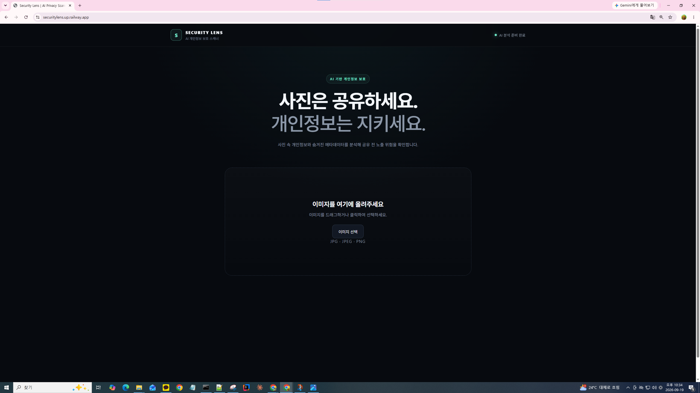
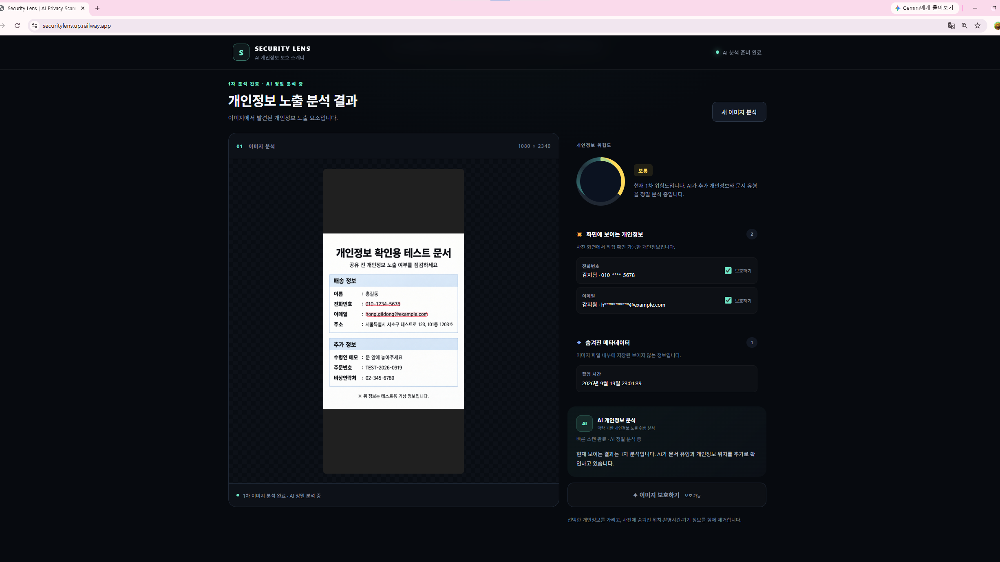
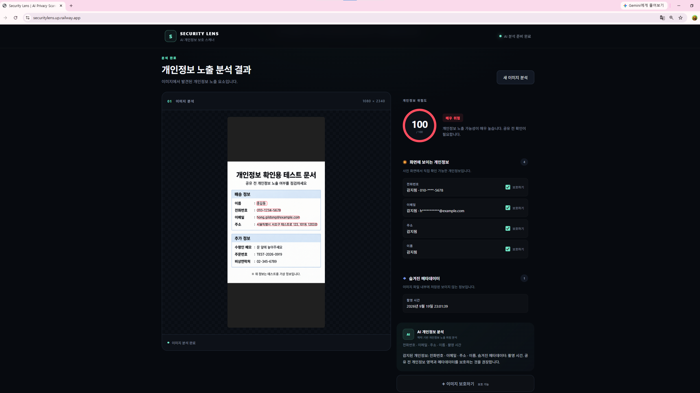
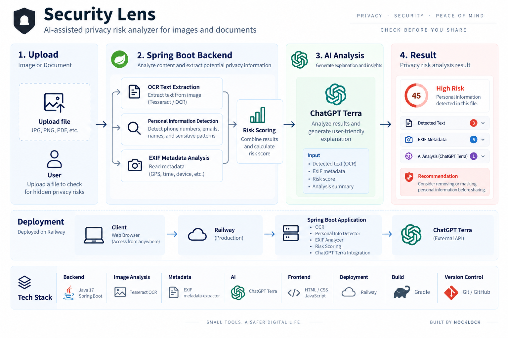

> AI-assisted privacy risk analyzer for images and documents.

이미지 속 개인정보와 EXIF 메타데이터를 분석해  
업로드 전에 개인정보 노출 위험을 확인할 수 있도록 만든 **Spring Boot 기반 MVP**입니다.

**Java 17 · Spring Boot · OCR · EXIF · ChatGPT Terra · Railway**

> Source code is kept private.  
> 이 저장소는 Security Lens의 제품 구조, 구현 과정, 기술적 의사결정과 학습 내용을 정리한 공개 Case Study입니다.

---

## Problem

사진이나 문서를 온라인에 업로드할 때 사용자가 눈으로 확인하기 어려운 개인정보가 함께 노출될 수 있습니다.

예를 들어 이미지에는 다음과 같은 정보가 포함될 수 있습니다.

- 전화번호
- 이메일 주소
- 이름 등 텍스트 개인정보
- GPS 위치
- 촬영 시간
- 기기 정보
- 기타 EXIF metadata

특히 EXIF 정보는 이미지 화면만 보고는 확인하기 어렵습니다.

Security Lens는 업로드 전에 이런 정보를 한 번에 분석하고  
사용자가 **“이 파일을 그대로 공유해도 되는가?”**를 판단할 수 있도록 만드는 것을 목표로 했습니다.

---

## What I Built

Security Lens는 이미지를 업로드하면 여러 분석 단계를 거쳐 개인정보 노출 위험을 보여줍니다.

### Core Flow

```text
Image Upload
      ↓
OCR Text Extraction
      ↓
Personal Information Detection
      ↓
EXIF Metadata Analysis
      ↓
Risk Score Calculation
      ↓
ChatGPT Terra Analysis
      ↓
Risk Level + Explanation
```

---

## Demo

### Upload & Analysis



### Analysis Result



### Risk Analysis



---

## Key Features

### 1. OCR-based Personal Information Detection

이미지에 포함된 텍스트를 OCR로 추출한 뒤 개인정보 패턴을 분석합니다.

현재 주요 탐지 대상:

- Phone number
- Email address
- Name-like information
- Sensitive text patterns

OCR 결과를 그대로 신뢰하기보다  
규칙 기반 탐지와 함께 사용해 개인정보 후보를 식별하도록 구성했습니다.

---

### 2. EXIF Metadata Analysis

이미지 파일에 포함된 메타데이터를 분석합니다.

주요 분석 정보:

- GPS coordinates
- Capture date and time
- Device / camera information
- Other available EXIF metadata

사용자가 화면만 보고는 알기 어려운 정보까지 분석 대상에 포함했습니다.

---

### 3. Privacy Risk Score

탐지된 정보를 단순히 나열하는 대신  
사용자가 빠르게 위험 수준을 이해할 수 있도록 **Risk Score와 Risk Level**을 설계했습니다.

```text
Detected Privacy Signals
        ↓
Weighted Risk Calculation
        ↓
Risk Score
        ↓
Risk Level
```

목표는 완벽한 보안 판정을 제공하는 것이 아니라,

> 사용자가 추가 확인이 필요한 파일을 빠르게 식별하도록 돕는 것

입니다.

---

### 4. LLM-assisted Risk Analysis

OCR / EXIF / rule-based 분석 결과를 기반으로  
**ChatGPT Terra**가 추가적인 위험 설명과 사용자 관점의 해석을 생성하도록 구성했습니다.

현재 AI 분석 계층:

- ChatGPT Terra

LLM이 개인정보 탐지 전체를 판단하도록 하지 않고 다음과 같이 역할을 분리했습니다.

```text
OCR / Rules / Metadata
          ↓
Deterministic Analysis
          ↓
Risk Scoring
          ↓
ChatGPT Terra
          ↓
Explanation / Recommendation
```

전화번호나 이메일처럼 구조가 명확한 정보는 rule-based 방식으로 탐지하고,  
LLM은 분석 결과를 설명하고 사용자가 확인해야 할 내용을 정리하는 **보조 계층**으로 사용했습니다.

---

## Architecture



Security Lens는 OCR, 규칙 기반 개인정보 탐지, EXIF 분석과 Risk Scoring을 먼저 수행한 뒤  
분석 결과를 ChatGPT Terra에 전달해 사용자에게 설명과 권고사항을 제공하도록 구성했습니다.

```text
Browser
   ↓
Spring Boot API
   ├── OCR Analyzer
   ├── Personal Info Detector
   ├── EXIF Analyzer
   ├── Risk Scoring
   └── ChatGPT Terra Analyzer
             ↓
   Risk Explanation / Recommendation
             ↓
          Result UI
```

### Deployment

```text
Client
  ↓
Railway
  ↓
Spring Boot Application
  ↓
Analysis Pipeline
  ↓
ChatGPT Terra
```

---

## Tech Stack

| Area | Technology |
|---|---|
| Backend | Java 17, Spring Boot |
| Image Analysis | OCR |
| Metadata | EXIF / metadata-extractor |
| AI | ChatGPT Terra |
| Frontend | HTML, CSS, JavaScript |
| Deployment | Railway |
| Build | Gradle |
| Version Control | Git / GitHub |

---

## Engineering Decisions

### Why Spring Boot?

기존 Java/Spring 개발 경험을 활용하면서  
이미지 분석, API, 개인정보 탐지, AI integration을 하나의 서비스 흐름으로 구현하기 위해 선택했습니다.

Spring Boot 기반으로 전체 분석 파이프라인을 구성하면서  
AI 기능을 별도의 실험이 아니라 기존 백엔드 서비스 안에 연결하는 경험을 목표로 했습니다.

---

### Why use an LLM for Additional Analysis?

전화번호나 이메일처럼 구조가 명확한 개인정보는  
LLM보다 deterministic rule이 더 안정적으로 처리할 수 있다고 판단했습니다.

반면 탐지 결과를 사용자에게 설명하고  
어떤 부분을 주의해야 하는지 정리하는 과정에서는 LLM이 유용했습니다.

따라서 Security Lens에서는 AI가 모든 판단을 대신하는 구조가 아니라,

```text
Rule-based Detection
+ OCR
+ EXIF Analysis
+ Risk Scoring
+ LLM Explanation
```

형태로 각 계층의 역할을 분리했습니다.

현재 MVP에서는 **ChatGPT Terra를 분석 및 설명 계층**으로 사용하고 있습니다.

---

### Why combine Rules with LLM Analysis?

LLM 하나에 개인정보 탐지와 위험 판단을 모두 맡기면  
일관성과 검증 가능성이 떨어질 수 있다고 판단했습니다.

그래서 다음과 같이 역할을 나누었습니다.

```text
Rules / OCR / Metadata
          +
      Risk Scoring
          +
    LLM Explanation
```

- 명확한 개인정보 패턴 → deterministic rule
- 이미지 텍스트 추출 → OCR
- 숨겨진 파일 정보 → EXIF analysis
- 위험도 계산 → Risk Score
- 사용자 관점 설명 → LLM

LLM은 최종 판정자가 아니라  
**추가 분석과 설명을 제공하는 보조 계층**으로 사용했습니다.

---

## Challenges & Solutions

### Local LLM Experiment

개발 초기에는 **Ollama와 Gemma 3**를 이용한 로컬 LLM 구조를 실험했습니다.

개인정보를 외부 AI 서비스로 보내지 않는 구조를 검토하기 위해  
로컬 추론 환경을 직접 구성했고 GPU / CUDA 및 CPU inference 환경도 테스트했습니다.

하지만 MVP를 완성하고 실제 서비스 흐름을 검증하는 과정에서 다음과 같은 제약을 경험했습니다.

- GPU / CUDA 환경 구성
- 로컬 추론 성능
- CPU inference 속도
- 실행 환경 복잡도
- 배포 환경 제약

이후 현재 버전에서는 **ChatGPT Terra를 AI 분석 계층으로 사용하는 구조로 변경**했습니다.

이 과정을 통해 모델 자체의 성능뿐 아니라

> **제품 요구사항 · 실행 환경 · 성능 · 운영 복잡도**

를 함께 고려해야 한다는 점을 경험했습니다.

---

### Port Conflicts during Local LLM Experiments

초기 Ollama 실험 과정에서 Spring Boot와 함께 실행하면서  
8080 / 11434 포트 및 환경 설정 문제를 해결했습니다.

현재 서비스 구조에서는 Ollama를 사용하지 않지만,  
이 과정에서 애플리케이션 코드뿐 아니라 실행 환경을 재현하고 문제를 추적하는 경험을 얻었습니다.

---

### Risk Scoring

단순히

> “개인정보가 발견되었습니다.”

라고 표시하는 것만으로는 사용자가 실제 위험 수준을 빠르게 판단하기 어렵다고 생각했습니다.

그래서 여러 탐지 결과를 하나의 **Risk Score / Risk Level**로 통합하는 구조를 설계했습니다.

현재 점수는 절대적인 보안 평가가 아니라  
사용자가 추가 검토가 필요한 파일을 식별하도록 돕는 신호로 사용합니다.

---

## What I Learned

Security Lens를 만들면서 가장 크게 배운 점은

> **AI 기능 하나를 추가하는 것과 실제 제품 흐름 안에 AI를 넣는 것은 다르다**

는 점이었습니다.

특히 다음을 경험했습니다.

- 기존 backend와 AI analysis layer 연결
- OCR 결과의 불확실성 처리
- rule-based detection과 LLM 역할 분리
- EXIF metadata 분석
- 개인정보를 다루는 제품의 데이터 흐름 고민
- Local LLM과 외부 AI 연동 방식의 trade-off
- 모델 선택과 운영 환경의 관계
- Risk Score 설계
- MVP를 실제 URL까지 배포하는 과정

또한 완벽한 기능을 기다리기보다

> **작동하는 MVP를 먼저 만들고 실제 문제를 확인한 뒤 개선한다**

는 개발 방식을 직접 경험했습니다.

---

## Next

현재 MVP 이후 개선하고 싶은 기능입니다.

- OCR accuracy improvements
- Bounding box visualization
- Automatic masking / redaction
- QR / barcode detection
- EXIF removal
- Better risk scoring
- Automated tests
- CI/CD
- AWS deployment architecture
- Improved privacy handling for AI analysis
- Clearer separation between deterministic analysis and AI-generated explanation

---

## Project Status

Security Lens는 **Wanted AI Championship 2026**을 위해 개발한 MVP입니다.

실제 구현 소스가 포함된 원본 저장소는 Private으로 유지하고 있습니다.

이 공개 저장소는 프로젝트의

- Problem
- Architecture
- Implementation Decisions
- Challenges
- Product Flow
- Lessons Learned

를 보여주기 위한 **Technical Case Study**입니다.

---

## About Nocklock

Java/Spring 백엔드 개발을 기반으로  
AI를 실제 제품 흐름에 연결하는 방법을 실험하고 기록하고 있습니다.

현재 관심 분야:

- Java / Spring Boot
- AI-assisted development
- Backend systems
- Privacy & security tooling
- Deployment workflows
- Developer automation
- Small software products

### Links

- [Nocklock Blog](https://nocklock.tistory.com/)
- [GitHub Profile](https://github.com/nocklock-h)

---

Built by **Nocklock**

> From idea → implementation → deployment → iteration.
